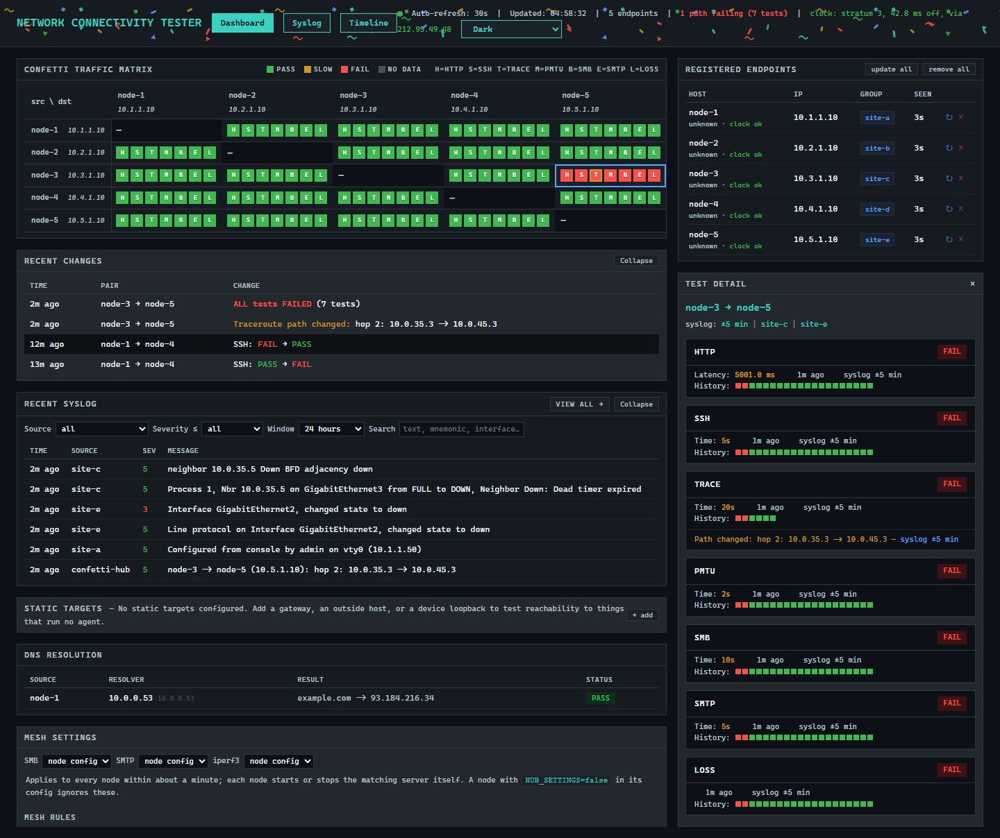

# Pervium

> **AI disclaimer:** This project was created using [Claude Code](https://claude.com/claude-code).

End-to-end connectivity testing between nodes on a network. It goes beyond
ICMP: it makes real TCP connections (HTTP, SSH, SMB, SMTP, iperf3) and
measures packet loss/jitter, path MTU, DNS and traceroute. Results show on a
web dashboard, optionally next to syslog from the network devices on the path.
The dashboard has eight colour themes (Dark, Light, Nord, Dracula, Solarized Dark,
Monokai, High Contrast, Terminal green), picked from the header, or Shuffle, which switches between them at random every 5-10 minutes.



*Mock data from a synthetic 5-node mesh, not a real lab. See
[Running the hub locally](#running-the-hub-locally).*

## Quick start

Each step runs on a different VM. To build it yourself step by step instead,
see [`docs/BUILD_GUIDE.md`](docs/BUILD_GUIDE.md).

**1. Base VM.** Install Alpine (`setup-alpine`), then clone it in vCenter
into two VMs: one for the hub, one for the node template. On each clone, run
this as root. It downloads the repo and starts `install.sh`, which asks
whether the VM becomes the hub or a node:

```sh
wget -O- https://github.com/orneh24/pervium/archive/refs/heads/main.tar.gz | tar -xz -C /root && mv /root/pervium-main /root/pervium && sh /root/pervium/install.sh
```

**2. Hub** (the clone where you picked *hub*). Log out and back in:
`hub-setup.sh` asks for the static IP (with prefix, e.g. `/24`) and the
gateway, which defaults to the subnet's `.1`. It also asks for an optional
DNS server and hostname. Then it restarts networking and starts the hub. Or run
the same steps by hand:

```sh
set-static-ip <hub-ip>/<cidr> <gateway> [dns] [hostname]
rc-service networking restart
rc-service pervium-hub start
```

Check that `http://<hub-ip>/` loads.

**3. Node template** (the clone where you picked *node*). The build already
cleaned it for cloning. Shut it down and convert it to a vCenter template.
Don't configure or test it first: that undoes the cleanup. Test on the first
clone instead.

**4. Nodes.** Clone the template once per network segment and put each clone
on its segment's port group. Then either:

- set `guestinfo.pervium.hub_url` and `guestinfo.pervium.group` on the
  clone before first boot, and it configures itself, or
- boot it, log in, and answer the `node-setup.sh` prompt.

The hostname is set automatically (`pv-<group>-<ab1234>`, e.g.
`pv-site-a-xd2311`). Check that the node appears at
`http://<hub-ip>/endpoints`.

**Or install a node straight from the hub**, with no template and no GitHub
access. On a plain Alpine VM, as root:

```sh
wget -O /tmp/i.sh http://<hub-ip>/install.sh && sh /tmp/i.sh [group]
```

Every node fetches its SSH keys from the hub at setup. The hub's management
key is trusted on first use and lets the hub push updates from the dashboard.
Set `HUB_MANAGED=false` in a node's config to opt it out.

`install.sh` refuses to run on a VM that is already a hub or node, because
re-running a build wipes its config or the hub's database. Pass `hub` or
`node` to skip the menu, and `-y` to skip the confirmation.

**Single VM, no cloning.** Run the step 1 command on a fresh Alpine VM,
then finish in place: for a hub, step 2; for a node, log out and back in and
answer the `node-setup.sh` prompt (or run `/usr/local/bin/pervium/setup.sh`).
Ignore the node build's "convert to template" message. Fresh VM only: an
existing `/root/pervium` makes the `mv` put the new copy inside it.

### Updating

Update the hub first: run `pervium-update` on it as root. It downloads the
latest code from GitHub, asks before changing anything, and keeps hub.env,
the database and the root password. It also rebuilds the node bundle the hub
serves.

Then update the nodes from the dashboard: the update button on a node's
row, or **update all**. The hub runs `pervium-update` on each node over SSH,
one at a time, and the node downloads the new code from the hub. Each node's
build shows under its name, in yellow when it differs from what the hub
serves.
`pervium-update` run on a node by hand does the same thing.

Details: [BUILD_GUIDE §6.3](docs/BUILD_GUIDE.md#63-updating).

### VMware guestinfo keys

Set these on the VM in vCenter (VM Options → Advanced → Configuration
Parameters, or PowerCLI `New-AdvancedSetting`) before first boot. Only the
two marked keys are required.

| Key | Role | Example | Notes |
|---|---|---|---|
| `guestinfo.pervium.hub_url` | node | `http://10.0.0.100` | **required** |
| `guestinfo.pervium.group` | node | `site-a` | **required**; groups nodes on the dashboard |
| `guestinfo.pervium.subnet` | node | `10.1.1.0/24` | taken from the DHCP lease if unset |
| `guestinfo.pervium.hostname` | node | `pv-site-a` | `pv-<group>-<ab1234>` if unset; must be unique |
| `guestinfo.pervium.dns_server` | node | `10.0.0.53` | unset skips the DNS test |
| `guestinfo.pervium.dns_query` | node | `example.com` | name the DNS test looks up |
| `guestinfo.hub.ip` | hub | `10.0.0.100/24` | if unset, `hub-setup.sh` asks at login |
| `guestinfo.hub.gateway` | hub | `10.0.0.1` | |
| `guestinfo.hub.dns` | hub | `10.0.0.53` | optional; without it the hub can't resolve names, so `pervium-update` can't download |
| `guestinfo.hub.hostname` | hub | `pervium-hub` | optional; unset keeps the template's hostname. Re-read at every boot, so a change applies at the next reboot |

More: [`docs/QUICKSTART.md`](docs/QUICKSTART.md) (reference tables) and
[`docs/DEPLOYMENT.md`](docs/DEPLOYMENT.md) (checklist with verification).

## What it tests

| Type | Label | Runs against |
|---|---|---|
| HTTP | H | every node pair, static targets |
| SSH | S | every node pair, static targets |
| Traceroute | T | every 5 min, and right after an HTTP or SSH failure |
| Path MTU | M | every node pair, static targets; catches paths that pass small packets but hang on large ones |
| DNS | D | one resolver per node, when `DNS_SERVER` is set |
| iperf3 | I | every node pair, when `ENABLE_IPERF=true` |
| SMB | B | every node pair, when `ENABLE_SMB=true` |
| Loss/jitter | L | every node pair, always on (`fping`) |
| SMTP | E | every node pair when `ENABLE_SMTP=true`, and static targets that list it; catches firewalls that rewrite SMTP instead of blocking it |

**Static targets** are addresses with no agent (gateways, loopbacks, outside
hosts). You add them once on the hub and every node tests them.

**Syslog correlation** is optional. The hub accepts RFC3164 syslog on
UDP/514. Each test result on the dashboard links to the syslog from ±5
minutes around it.

## Architecture

- **Hub**: Alpine VM, ~192 MB RAM. Collects and shows results; never tests.
  Flask + SQLite, served by waitress, with a syslog receiver and a Hub Health
  panel.
- **Nodes**: Alpine VMs, ~128 MB RAM, one per network segment. Cloned from
  one template. Cron runs the tests every 60 s and pushes results to the hub.

Full design and the constraints that must not regress:
[`CLAUDE.md`](CLAUDE.md). Open items and roadmap:
[`docs/ROADMAP.md`](docs/ROADMAP.md).

### Other hypervisors

Built and tested on vSphere, but any hypervisor that runs Alpine should work
(Proxmox/KVM, Hyper-V, VirtualBox, bare metal).

### Why not Docker?

The project measures a real network path. Containers on one host share a
kernel and a virtual bridge, so traffic never crosses the switches,
firewalls and tunnels the tests exist to check. PMTU, SMTP inspection and
loss would all pass trivially and prove nothing.

Docker has one narrow use here: the `golden-image-verifier` agent uses an
Alpine container to check package installs and daemon startup. For local work
without VMs, see [`dev/README.md`](dev/README.md): it runs the real scripts
against a real hub, with the network tools faked.

## Running the hub locally

```sh
cd hub
HUB_DB_PATH=/tmp/hub.db HUB_PORT=8099 HUB_SYSLOG_PORT=5514 python3 serve.py
```

Use `serve.py`, not `flask run`: it reads `HUB_PORT` and starts the syslog
listener. Ports below 1024 need root, hence the high ports.

## Docs

| File | Covers |
|---|---|
| [`docs/QUICKSTART.md`](docs/QUICKSTART.md) | Reference: ports, files, config keys, admin commands |
| [`docs/DEPLOYMENT.md`](docs/DEPLOYMENT.md) | Build order and checklist, with verification |
| [`docs/TOPOLOGY.md`](docs/TOPOLOGY.md) | System diagram |
| [`docs/ROADMAP.md`](docs/ROADMAP.md) | Not yet built, not yet verified, decided against |
| [`CLAUDE.md`](CLAUDE.md) | Architecture, design decisions, constraints |
| [`dev/README.md`](dev/README.md) | Local hub and simulated mesh, no VMs |
| [`deploy/README.md`](deploy/README.md) | PowerCLI script to deploy a hub and N nodes |
