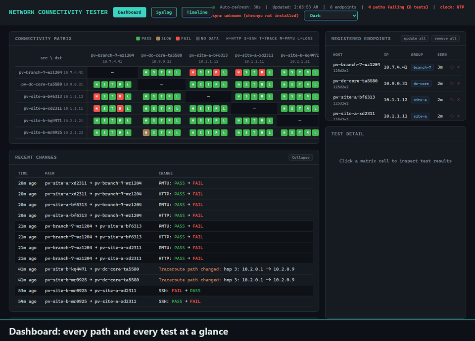

# Confetti Traffic

> **AI disclaimer:** This project was created using [Claude Code](https://claude.com/claude-code) for training/labbing purposes - use freely, but at own risk :-)

**Menu**

- [Tests](#tests)
- [Quick start](#quick-start)
  - [Install the hub](#1-install-the-hub)
  - [Add nodes](#2-add-nodes)
  - [Updating](#updating)
  - [VMware guestinfo keys](#vmware-guestinfo-keys-optional)
- [Architecture](#architecture)
  - [Other hypervisors](#other-hypervisors)
  - [Why not Docker?](#why-not-docker)
- [Running the hub locally](#running-the-hub-locally)
- [Docs](#docs)

End-to-end connectivity testing between nodes on a network. It goes beyond
ICMP: it makes real TCP connections (HTTP, SSH, SMB, SMTP, iperf3) and
measures packet loss/jitter, path MTU, DNS and traceroute. Results show on a
web dashboard, optionally next to syslog from the network devices on the path.
A Timeline page groups failures, route changes, syslog and bandwidth tests into incidents, and a slider replays the mesh at any earlier moment (1 hour, 6 hours or 24 hours back).



*The three hub pages: Dashboard, Syslog and Timeline, then the dashboard in
the Confetti Night theme. Mock data from a synthetic 6-node mesh, not a real
lab. See [Running the hub locally](#running-the-hub-locally).*

## Tests

Every node tests every other node once a minute. Each matrix cell shows one
letter per test: green pass, yellow slow, red fail, grey no data. A dashed outline means
flapping (5+ pass/fail flips in the last hour).

| Test | Checks | Runs |
|---|---|---|
| **H** HTTP | 5-file site, byte for byte | always |
| **S** SSH | key login | always |
| **M** Path MTU | 1500-byte DF packet | always |
| **L** Loss | loss and jitter | always |
| **T** Traceroute | hop path changes | 5 min, and after H/S fails |
| **D** DNS | name lookup | `DNS_SERVER` set |
| **I** iperf3 | TCP throughput | opt-in |
| **B** SMB | 8 MB download | opt-in |
| **E** SMTP | mail rewriting (never sends) | opt-in |

Static targets (gateways, loopbacks, outside hosts) get the tests that apply
to them. Optional syslog from network devices (UDP/514) is linked from each
result, and a failing pair lists what the devices logged.

Opt-in tests, mesh rules, static targets and on-demand bandwidth tests:
[BUILD_GUIDE §6](docs/BUILD_GUIDE.md#6-ongoing-operation).

## Quick start

Two parts: install the hub first, then add nodes. To build it yourself step
by step instead, see [`docs/BUILD_GUIDE.md`](docs/BUILD_GUIDE.md).

### 1. Install the hub

1. **Base VM.** Install Alpine on a new VM (`setup-alpine`). Put it on a
   segment that every node subnet and your workstation can reach.
2. **Run the installer** as root. It downloads the repo to `/root/confetti`
   and starts `confettictl-install.sh`, which asks whether the VM becomes a hub
   or a node. Pick *hub*:

   ```sh
   wget -O /tmp/oi.sh https://github.com/orneh24/confetti-traffic/raw/main/online-install.sh && sh /tmp/oi.sh
   ```

   Add `hub` or `node` at the end to skip the question. Save the script and
   run it as shown; don't pipe it into `sh`, or it can't ask its questions.

3. **Configure the network.** When the build finishes, the installer asks for
   the hub's static IP, gateway, and optional DNS server and hostname, then
   starts the hub. If you skip it, it asks again at your next login.

   For bulk or scripted deployments, set `guestinfo.hub.ip`,
   `guestinfo.hub.gateway` (and optionally `guestinfo.hub.dns`,
   `guestinfo.hub.hostname`) on the VM in vCenter before first boot, and the
   hub configures itself.
4. **Check** that `http://<hub-ip>/` loads.

### 2. Add nodes

There are two ways. Both give the same result: a node that registers with the
hub and shows up at `http://<hub-ip>/endpoints`. The hostname is set
automatically (`ct-<group>-<ab1234>`, e.g. `ct-site-a-xd2311`).

**Option A: straight from the hub (one line).** On a plain Alpine VM with
network access to the hub, as root. No template, no GitHub access needed:

```sh
wget -O /tmp/i.sh http://<hub-ip>/install.sh && sh /tmp/i.sh [group]
```

It downloads the node bundle from the hub, installs it, and asks for the
group if you did not pass one. Good for a few nodes, or where a VM can't be
cloned.

**Option B: vCenter template.** Best for many nodes.

1. On a second Alpine VM, run the same installer as in part 1 and pick
   *node*. When it asks, enter the hub URL (e.g. `http://10.0.0.100`): it is
   stored in the template, so clones don't ask for it. (Unattended:
   `CONFETTI_HUB_URL=http://10.0.0.100 sh /tmp/oi.sh node`.) The build
   cleans the VM for cloning when it finishes.
2. Shut it down and convert it to a vCenter template. Don't configure or test
   it first: that undoes the cleanup. Test on the first clone instead.
3. Clone the template once per network segment and put each clone on its
   segment's port group.
4. Configure each clone:
   - **A small set of nodes:** boot the clone and log in. The
     `confettictl-node-setup.sh` prompt uses the hub URL from the template and
     asks only for the group.
   - **Bulk or scripted deployments (recommended):** before first boot, set
     `guestinfo.confetti.hub_url` and `guestinfo.confetti.group` on each clone,
     e.g. from a PowerCLI script (all keys are listed under
     [VMware guestinfo keys](#vmware-guestinfo-keys-optional)). The clone then
     configures itself with no login. Guestinfo wins over the template's
     hub URL.

Every node fetches its SSH keys from the hub at setup. The hub's management
key is trusted on first use and lets the hub push updates from the dashboard.
Set `HUB_MANAGED=false` in a node's config to opt it out.

`confettictl-install.sh` refuses to run on a VM that is already a hub or node, because
re-running a build wipes its config or the hub's database. Pass `hub` or
`node` to skip the menu, and `-y` to skip the confirmation.

**Single VM, no cloning.** Run the installer on a fresh Alpine VM, then
answer *yes* when it asks to configure the VM now (for a node the default is
*no*, since nodes are usually cloned first). Said no? Log out and back in and
answer the setup prompt, or run `confettictl-hub-setup.sh` / `confettictl-node-setup.sh`.
Ignore the node build's "convert to template" message.

### Updating

Update the hub first: run `confettictl-update` on it as root. It downloads the
latest code from GitHub, asks before changing anything, and keeps hub.env,
the database and the root password. It also rebuilds the node bundle the hub
serves.

Then update the nodes from the dashboard: the update button on a node's
row, or **update all**. The hub runs `confettictl-update` on each node over SSH,
one at a time, and the node downloads the new code from the hub. Each node's
build shows under its name, in yellow when it differs from what the hub
serves.
`confettictl-update` run on a node by hand does the same thing.

Details: [BUILD_GUIDE §6.3](docs/BUILD_GUIDE.md#63-updating).

### VMware guestinfo keys (Optional)

Set these on the VM in vCenter (VM Options → Advanced → Configuration
Parameters, or PowerCLI `New-AdvancedSetting`) before first boot. Only the
two marked keys are required.

| Key | Example | Notes |
|---|---|---|
| `guestinfo.confetti.hub_url` | `http://10.0.0.100` | **required** |
| `guestinfo.confetti.group` | `site-a` | **required**; groups nodes on the dashboard |
| `guestinfo.confetti.subnet` | `10.1.1.0/24` | default: from DHCP lease |
| `guestinfo.confetti.hostname` | `ct-site-a` | default: `ct-<group>-<ab1234>`; must be unique |
| `guestinfo.confetti.dns_server` | `10.0.0.53` | unset skips the DNS test |
| `guestinfo.confetti.dns_query` | `example.com` | name the DNS test looks up |
| `guestinfo.hub.ip` | `10.0.0.100/24` | unset: asked at login |
| `guestinfo.hub.gateway` | `10.0.0.1` | |
| `guestinfo.hub.dns` | `10.0.0.53` | needed for `confettictl-update` |
| `guestinfo.hub.hostname` | `confetti-hub` | re-read every boot |

`guestinfo.confetti.*` keys go on nodes, `guestinfo.hub.*` keys on the hub.

More: [`docs/QUICKSTART.md`](docs/QUICKSTART.md) (reference tables) and
[`docs/DEPLOYMENT.md`](docs/DEPLOYMENT.md) (checklist with verification).

## Architecture

- **Hub**: Alpine VM, ~192 MB RAM. Collects and shows results; never tests.
  Flask + SQLite, served by waitress, with a syslog receiver and a Hub Health
  panel.
- **Nodes**: Alpine VMs, ~128 MB RAM, one per network segment. Cloned from
  one template. Cron runs the tests every 60 s and pushes results to the hub.
- **Names on the VMs**: OpenRC services start with `confettid-`
  (`confettid-hub` on the hub; `confettid-httpd`, `-smbd`, `-smtpd`,
  `-iperf3` on nodes). Scripts and commands start with `confettictl-`
  (`confettictl-update`, `confettictl-status`, `confettictl-trust-hub`).
  Everything else uses `confetti`: `/opt/confetti-hub`, `/etc/confetti`,
  `guestinfo.confetti.*`.

Full design and the constraints that must not regress:
[`CLAUDE.md`](CLAUDE.md). Open items and roadmap:
[`docs/ROADMAP.md`](docs/ROADMAP.md).

### Other hypervisors

Built and tested on vSphere, but any hypervisor that runs Alpine should work
(Proxmox/KVM, Hyper-V, VirtualBox, bare metal).

### Why not Docker?

The project measures a real network path. Containers on one host share a
kernel and a virtual bridge, so traffic never crosses the switches,
firewalls and tunnels the tests exist to check. PMTU, SMTP inspection and
loss would all pass trivially and prove nothing.

Docker has one narrow use here: the `golden-image-verifier` agent uses an
Alpine container to check package installs and daemon startup. For local work
without VMs, see [`dev/README.md`](dev/README.md): it runs the real scripts
against a real hub, with the network tools faked.

## Running the hub locally

```sh
cd hub
HUB_DB_PATH=/tmp/hub.db HUB_PORT=8099 HUB_SYSLOG_PORT=5514 python3 serve.py
```

Use `serve.py`, not `flask run`: it reads `HUB_PORT` and starts the syslog
listener. Ports below 1024 need root, hence the high ports.

## Docs

| File | Covers |
|---|---|
| [`docs/QUICKSTART.md`](docs/QUICKSTART.md) | Reference: ports, files, config keys, admin commands |
| [`docs/DEPLOYMENT.md`](docs/DEPLOYMENT.md) | Build order and checklist, with verification |
| [`docs/TOPOLOGY.md`](docs/TOPOLOGY.md) | System diagram |
| [`docs/ROADMAP.md`](docs/ROADMAP.md) | Not yet built, not yet verified, decided against |
| [`CLAUDE.md`](CLAUDE.md) | Architecture, design decisions, constraints |
| [`dev/README.md`](dev/README.md) | Local hub and simulated mesh, no VMs |
| [`deploy/README.md`](deploy/README.md) | PowerCLI script to deploy a hub and N nodes |
